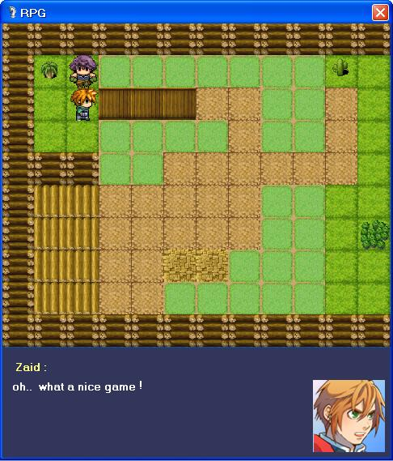



## RPG Game Engine

### Description

[RPG Game Engine] is open source code engine, let you to make your own rpg game, support SellerS+Wars+Story+Commands during the game, also it save any change on the map after skip to other.. and let you to add more blocks and items on the game.. it's the most complex RPG maker on VB 6.0 !
 
### More Info
 

             |
---                |---
**Submitted On**   |2009-05-21 23:54:38
**By**             |[Zaid Markabi](https://github.com/Planet-Source-Code/PSCIndex/blob/master/ByAuthor/zaid-markabi.md)
**Level**          |Advanced
**User Rating**    |5.0 (10 globes from 2 users)
**Compatibility**  |VB 5\.0, VB 6\.0
**Category**       |[Games](https://github.com/Planet-Source-Code/PSCIndex/blob/master/ByCategory/games__1-38.md)
**World**          |[Visual Basic](https://github.com/Planet-Source-Code/PSCIndex/blob/master/ByWorld/visual-basic.md)
**Archive File**   |[RPG\_Game\_E2154696102009\.zip](https://github.com/Planet-Source-Code/zaid-markabi-rpg-game-engine__1-72172/archive/master.zip)

